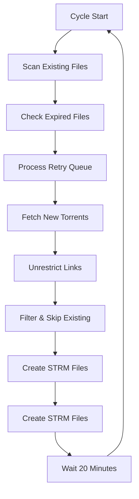

# 🐳 Real Debrid Media Manager

**Intelligent cycle-based media processor with 14-day refresh system**

[](https://github.com/Optimism-Bliss/Real-debrid-Strm/actions/workflows/docker-build.yml)
[](https://opensource.org/licenses/MIT)

🔄 **Intelligent Cycle-Based Media Processor** for Real Debrid with automated retry logic and file expiration management.

## 🎯 Key Features

### 🔄 **Smart Cycle Management**
- **20-minute cycles** with configurable intervals
- **Skip existing files** until expiration (14 days)
- **Persistent retry queue** for failed downloads
- **Zero downtime** continuous processing

### 🛡️ **Intelligent Error Handling**
- **503 Server Errors**: Retry 2x per cycle, queue for next cycle
- **429 Rate Limits**: Exponential backoff with 3 retries
- **Full Pagination**: Fetch ALL torrents, not just first page
- **Conservative Rate Limiting**: 200 req/min (safe from 240 limit)

### 📁 **Organized Output Structure**
```
/media/unorganized/
├── Family.Guy.S05.1080p.../     # TV Season
├── Interstellar.2014.4K/        # Movie
├── Modern.Family.Complete/       # Complete Series
└── Misc/                         # Unmatched files
```

### 🎯 **Smart Filtering**
- **Video files ≥300MB** (filters out ads/trailers)
- **All subtitle formats** (.srt, .ass, .vtt, etc.)
- **Extension cleanup** from folder names
- **Standard permissions** for easy access

## �� Quick Start

### 1\. **Setup Environment**

# Clone repository (optional - for custom builds)
git clone https://github.com/Optimism-Bliss/Real-debrid-Strm.git
cd Real-debrid-Strm

# Configure API key
cp env-example.txt .env
nano .env  # Add your REAL_DEBRID_API_KEY

### 2\. **Deploy Container**

#### **Option A: Pre-built Image (Recommended)**

```yaml
# docker-compose.yml
version: '3.8'
services:
  realdebrid-media:
    image: ghcr.io/optimism-bliss/real-debrid-strm:latest
    container_name: realdebrid-media-manager
    environment:
      - REAL_DEBRID_API_KEY=${REAL_DEBRID_API_KEY}
      - CYCLE_INTERVAL_MINUTES=20
      - FILE_EXPIRY_DAYS=14
    volumes:
      - ./media:/app/media
      - ./logs:/app/logs
      - ./output:/app/output
    restart: unless-stopped
    healthcheck:
      test: ["CMD", "python", "-c", "import os; exit(0 if os.path.exists('/app/logs') else 1)"]
      interval: 2m
      timeout: 30s
      retries: 3
```

```bash
# Quick deploy with pre-built image
docker-compose up -d
```

#### **Option B: Build from Source**

```bash
# Build and deploy locally
docker-compose up --build -d
```

#### **Option C: Portainer (GUI)**
1. **Access Portainer** → **"Stacks"** → **"Add stack"**
2. **Name**: `realdebrid-media-manager`
3. **Build method**: Repository
4. **Repository URL**: `https://github.com/Optimism-Bliss/Real-debrid-Strm`
5. **Compose path**: `portainer-stack.yml`
6. **Environment Variables**:
   ```
   REAL_DEBRID_API_KEY=your_api_key_here
   CYCLE_INTERVAL_MINUTES=20
   FILE_EXPIRY_DAYS=14
   ```
7. **Update volume paths** for your system
8. **Deploy the stack**

📖 **Detailed Portainer guide**: [PORTAINER_DEPLOY.md](PORTAINER_DEPLOY.md)

### 3\. **Pre-built Images Available**

| Image Tag | Description | Build Status |
|-----------|-------------|--------------|
| `latest` | Latest stable build from main branch | [](https://github.com/Optimism-Bliss/Real-debrid-Strm/actions/workflows/docker-build.yml) |
| `v2.0.0` | Cycle management system | ✅ Stable |

```bash
# Pull latest image
docker pull ghcr.io/optimism-bliss/real-debrid-strm:latest

# Run directly
docker run -d \
  --name realdebrid-media \
  -e REAL_DEBRID_API_KEY=your_key_here \
  -v ./media:/app/media \
  -v ./logs:/app/logs \
  ghcr.io/optimism-bliss/real-debrid-strm:latest
```

### 3. **Expected Output**
```
🔄 Starting new processing cycle
📊 Cycle Status:
   📁 Existing STRM files: 1,500
   📅 Expired files (>14 days): 50
   🔄 Retry queue: 15 items
🔄 Retry queue: 12/15 succeeded
📡 Fetching fresh data from Real Debrid API
🔍 Filtering Results:
   📂 Total files found: 500
   ✅ Files processed: 300
   ⏭️  Skipped existing: 150
✅ Cycle completed in 180.5s
💤 Waiting 20 minutes for next cycle...
```

## ⚙️ Configuration

### Environment Variables

| Variable | Default | Description |
|----------|---------|-------------|
| `REAL_DEBRID_API_KEY` | - | **Required** - Your API token |
| `CYCLE_INTERVAL_MINUTES` | 20 | How often to run cycles |
| `FILE_EXPIRY_DAYS` | 14 | When to refresh STRM files |
| `RETRY_503_ATTEMPTS` | 2 | Server error retries per cycle |
| `RETRY_429_ATTEMPTS` | 3 | Rate limit retries |
| `LOG_LEVEL` | INFO | DEBUG, INFO, WARNING, ERROR |

### Custom Configuration
```bash
# .env file example
CYCLE_INTERVAL_MINUTES=30     # Every 30 minutes
FILE_EXPIRY_DAYS=7           # Refresh weekly
RETRY_503_ATTEMPTS=3         # More aggressive retry
LOG_LEVEL=DEBUG              # Detailed logging
```

## 📊 How It Works

### 🔄 **Cycle Workflow**


### 🛡️ **Error Handling Strategy**
- **503 Errors** (Server Issues): Retry 2x → Queue for next cycle
- **429 Errors** (Rate Limits): Exponential backoff → 2s, 4s, 8s
- **Network Issues**: Auto-retry with connection recovery
- **File Conflicts**: Skip existing until expiry

### 📅 **File Expiration System**
- **Day 1-13**: Skip existing files (performance boost)
- **Day 14+**: Refresh expired STRM files (fresh links)
- **Tracking**: Persistent JSON database of all files
- **Cleanup**: Auto-remove orphaned tracking data

## 🔍 Monitoring

### Real-time Logs
```bash
# Container logs
docker-compose logs -f realdebrid-media

# Error analysis
docker-compose logs realdebrid-media | grep -E "(ERROR|WARNING)"

# Cycle performance
docker-compose logs realdebrid-media | grep "Cycle.*completed"
```

### Key Metrics to Watch
- **Cycle Duration**: Should be <5 minutes for incremental runs
- **Skip Rate**: High % means efficient duplicate detection
- **503 Errors**: Should be <10% (Real Debrid server issues)
- **429 Errors**: Should be <1% (good rate limiting)

## 🛠️ Advanced Usage

### TrueNAS Scale Deployment
```yaml
# docker-compose.override.yml
services:
  realdebrid-media:
    user: "950:950"  # TrueNAS apps user
    volumes:
      - /mnt/pool/media:/app/media
      - /mnt/pool/logs:/app/logs
    environment:
      - CYCLE_INTERVAL_MINUTES=15  # More frequent
```

### Performance Tuning
```bash
# Large libraries (>5000 torrents)
CYCLE_INTERVAL_MINUTES=60        # Less frequent cycles
RETRY_503_ATTEMPTS=1             # Faster failure
LOG_LEVEL=WARNING                # Reduce log volume

# Small libraries (<1000 torrents)
CYCLE_INTERVAL_MINUTES=10        # More frequent
FILE_EXPIRY_DAYS=30              # Longer cache
```

### Custom Filtering
Modify `app/real_debrid_processor.py`:
```python
# Stricter size filtering
self.min_video_size_mb = 500

# Additional video formats
self.allowed_video_extensions.add('.ts')
self.allowed_video_extensions.add('.m2ts')
```

## 📋 Comparison: v1.0 vs v2.0

| Feature | v1.0 (Single Run) | v2.0 (Cycle System) |
|---------|-------------------|----------------------|
| **Processing** | One-time execution | Continuous 20-min cycles |
| **Duplicates** | Always reprocess | Skip until expiry |
| **Error Handling** | Fail and stop | Retry queue system |
| **Fresh Content** | Manual restart | Auto-refresh expired |
| **Efficiency** | High initial load | Incremental updates |
| **Reliability** | Single point failure | Self-healing cycles |

## 🚨 Troubleshooting

### Common Issues

#### High Memory Usage
```yaml
# Add resource limits
deploy:
  resources:
    limits:
      memory: 1G
    reservations:
      memory: 256M
```

#### Slow Cycles
- Reduce `CYCLE_INTERVAL_MINUTES` for faster feedback
- Check `FILE_EXPIRY_DAYS` - longer = more skips
- Monitor 503 error rate from Real Debrid

#### Files Not Updating
- Check `FILE_EXPIRY_DAYS` setting
- Verify file timestamps in tracking data
- Ensure sufficient disk space

### Debug Mode
```bash
# Enable detailed logging
echo "LOG_LEVEL=DEBUG" >> .env
docker-compose restart

# Check cycle tracking files
docker-compose exec realdebrid-media ls -la /app/output/
```

## 🎉 Benefits

### For Users
- **🔄 Set and Forget**: Continuous automated processing
- **💰 Cost Efficient**: Skip existing files = less API usage
- **🔄 Always Fresh**: Auto-refresh expired links
- **🛡️ Reliable**: Built-in error recovery

### For Media Servers
- **📁 Clean Organization**: `/unorganized/` ready for AI classification
- **⚡ Fast Updates**: Incremental changes only
- **🔗 Valid Links**: Auto-refresh prevents dead links
- **🎯 Quality Content**: Smart filtering removes junk

## 📞 Support

- 📊 **Log Analysis**: Most issues visible in container logs
- 🔄 **Cycle Issues**: Check tracking files in `/app/output/`
- 🌐 **API Problems**: 503 errors are Real Debrid temporary issues
- ⚙️ **Configuration**: All settings via environment variables

---

**Ready for production deployment with intelligent automation** 🚀 